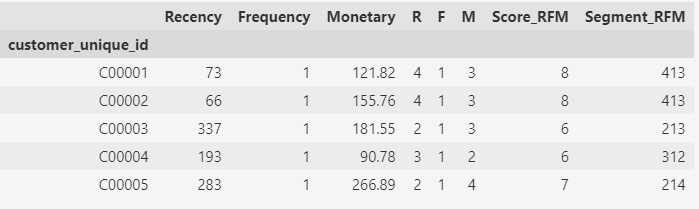
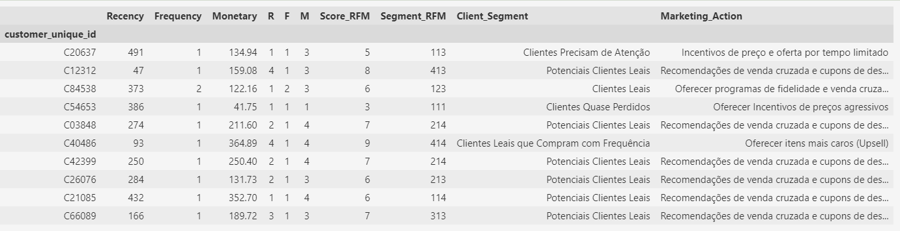
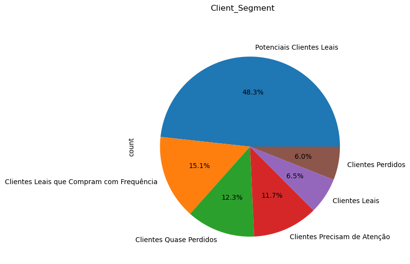
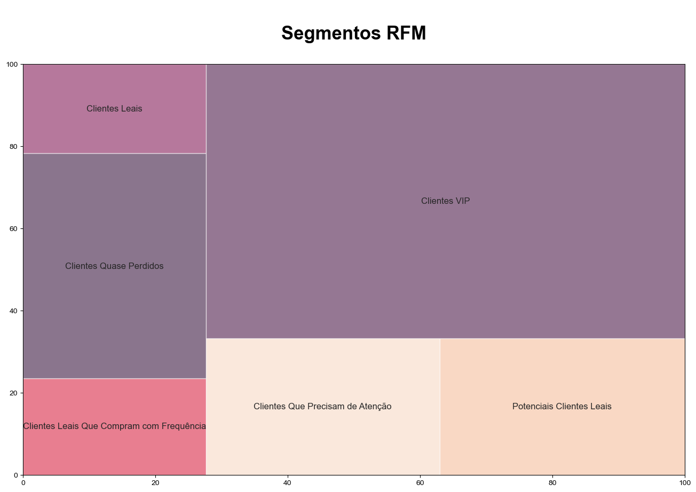

# RFM_Analysis
Este projeto envolve a aplicação da análise RFM (Recency, Frequency, Monetary Value) para segmentar clientes e avaliar seu comportamento de compra em uma empresa de ecommerce.

Dataset: https://www.kaggle.com/datasets/olistbr/brazilian-ecommerce

**Recomendações Para a Área de Negócio:**

**Clientes Leais** - São os clientes mais leais. Eles são ativos com compras frequentes e alto valor monetário. Eles podem ser os evangelistas da marca e a empresa deve se concentrar em servi-los muito bem. Eles podem ser os melhores clientes para obter feedback sobre o lançamento de qualquer novo produto ou ser os primeiros a adotar ou promover novos produtos/serviços.

**Potenciais Clientes Leais** - Alto potencial para entrar em nossos segmentos de clientes fiéis, por que não oferecer alguns brindes em sua próxima compra para mostrar que você os valoriza?

**Clientes Que Precisam de Atenção** - Mostrando sinais promissores com a quantidade e valor de sua compra, mas já faz um tempo que não compram. Vamos direcioná-los para seus itens da lista de desejos e um desconto com oferta por tempo limitado.

**Clientes Quase Perdidos** - Fizeram algumas compras iniciais, mas não voltaram desde então. Foi uma experiência ruim para o cliente? Ou adequação ao mercado do produto? Vamos gastar alguns recursos para construir o conhecimento de nossa marca com eles?

**Clientes Leais Que Compram com Frequência** - É sempre uma boa ideia tratar cuidadosamente todos os novos clientes, mas como esses clientes gastaram muito em suas compras, são ainda mais valiosos. É importante fazer com que eles se sintam valorizados e apreciados - e dar-lhes incentivos incríveis para continuar a interagir com a marca.

**Clientes VIP** - Buscam e querem mais do que preço. Programa de fidelidade ou produto/serviço exclusivo ou limitado são opções para manter esses clientes.

